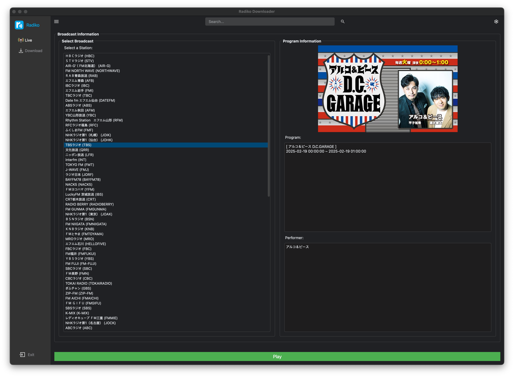

# pyqt5-radiko-system

`pyqt5-radiko-system` can record the [radiko.jp](https://radiko.jp/) programs outside of Japan.

```
pyqt5-radiko-streaming
├─ LICENSE.txt
├─ README.md
├─ dark_style.qss
├─ data
│  ├─ auth
│  │  └─ auth_key.bin
│  ├─ json
│  │  └─area.json
│  └─ mp3
├─ images
│  ├─ icons
│  │  ├─ dark
│  │  │  ├─ antenna-512-color.png
│  │  │  ├─ antenna-512.png
│  │  │  ├─ exit-512.png
│  │  │  ├─ menu-32.png
│  │  │  ├─ save-512-bg.png
│  │  │  ├─ save-512.png
│  │  │  ├─ search-32.png
│  │  │  └─ settings-32.png
│  │  ├─ light
│  │  │  ├─ antenna-512-color.png
│  │  │  ├─ antenna-512.png
│  │  │  ├─ exit-512.png
│  │  │  ├─ menu-32.png
│  │  │  ├─ save-512-bg.png
│  │  │  ├─ save-512.png
│  │  │  ├─ search-32.png
│  │  │  └─ settings-32.png
│  │  ├─ podcasts-32.png
│  │  └─ settings.png
│  └─ images
│     ├─ profile-circle.png
│     └─ radiko.png
├─ light_style.qss
├─ main.py
├─ radiko.py
├─ requirements.txt
├─ sidebar_ui.py
└─ style.qss

```

## Warning
**Please do not use this project for commercial use. Only for your personal, non-commercial use.**

## Technologies
- `Python` : 3.12
- `PyQt`
- `FFmpeg`

# Technical Details
The authentication of PC(html5) version radkio validates user's location via IP address.
However, the android version of radkio validates user provided by GPS information, not via user's IP address.

# Getting Started
## Installation
- You can install it **locally:**
  ```console
  $ git clone https://github.com/devhaaana/pyqt5-radiko-system.git
  $ cd pyqt5-radiko-system
  ```

- Make sure you have **Python** installed on your system. Then, install the **required packages** by running the following command:
  ```console
  conda create -n radiko_env python=3.12
  conda activate radiko_env
  pip install -r requirements.txt
  ```

## Usage
```console
python main.py
```




## Reference
- [rajiko](https://github.com/jackyzy823/rajiko)
- [radiko-downloader](https://github.com/devhaaana/radiko-downloader.git)
